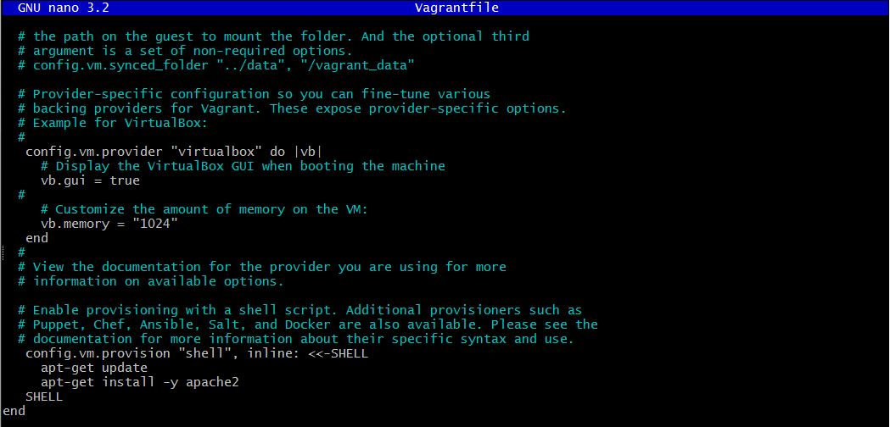
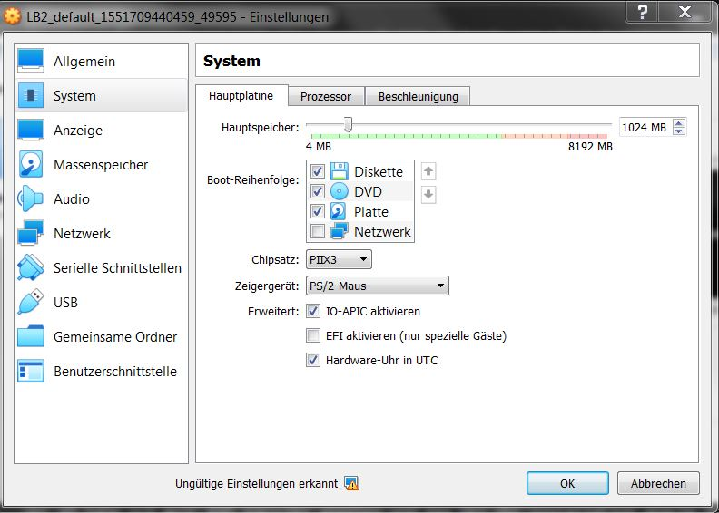
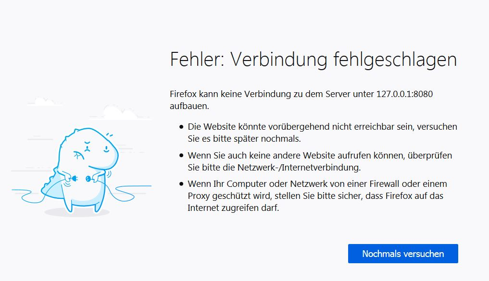

# LB2


## Inhaltsverzeichnis
***

- [K2 Persönlicher Wissenstand](#K2-Persönlicher-Wissenstand)
- [K3 Vagrant](#K3-Vagrant)
- [K4 Sicherheit](#K4-Sicherheit)
- [K5 Lehrentwicklung](K5-Lehrentwicklung)


## K2 Persönlicher Wissenstand
***

> [^ **Nach oben**](#Inhaltsverzeichnis)

Mein aktueller Wissensstand den ich vor dem Modul 300 hatte.

### Linux
***

Linux habe ich in den Vorherigen Modulen nicht so offt gebraucht, hatte aber im Betrieb ein Praktikum in dem ich 3 Monate nur mit Unix gearbeitet habe.


### Virtualisierung
***

Virtualisierung kannte ich schon vor den Vorherigen Modulen, dort haben wir auch schon verschiedenen Server und Client aufgesetzt. Auch hatte ich schon Erfahrungen im Betrieb gesammelt. Aktuell vertiefe ich die Virtualisierung im ÜK Modul 340.

### Vagrant
***

Vagrant kannte ich vor dem Modul noch nicht und hatte demensprechend noch keine Ahnung.

### Versionsverwaltung/Git
***

Die Versionenverwaltung sagt mir etwas, da ich am Rande von einem Pratikum damit zutun hatte. GitHub kannte ich vom hören her, habe es selber aber noch nie gebraucht.

### Mark Down
***
Mark Down kannte ich auch noch nicht vor dem Modul, ist mir somit ganz unbekannt.


### Systemsicherheit 
***

Systemsicherheit ist ein grosser Begriff in der IT, in vielen Modulen wird das angeschaut, demensprechend besitze ich mehr oder weniger Kenntnisse davon.


## K3 Vagrant
***

> [^ **Nach oben**](#Inhaltsverzeichnis)

Ich habe folgende VM heruntergeladen: [debian/stretch64](https://app.vagrantup.com/debian/boxes/stretch64)  

Folgende Sachen habe ich im Vagrantfile angepasst:   
Der VM habe ich mehr RAM Speicher gegeben und das bei der Installation apache heruntergeladen und installiert werden sollte.





### Vagrant Befehle
***

Die gängisten Vagrant Befehle die auch ich benutzt habe, finden Sie [hier](../Tipps/README.md)

### VM Test
***

Ich habe folgende Test aufgeführt um zu überprüfen ob die VM richtig aufgesetz wurde und funktioniert. 

Der erste Test ist die Überprüfung ob die VM wirklich  1024 MB RAM zugewissen bekommen hat. Dazu schaute ich in den Einstellungen vom VirtualBox.





Der zweite Test war das Starten/verbinden mit der VM. Dies klappte wunderbar.   
Der letzte Test war die Überprüfung ab der Apache Server läuft. dazu ging ich auf [127.0.0.1:8080](127.0.0.1:8080). Leider ist die Seite nicht erreichbar.



Laut der Installation ist der Apache Server installiert worden, aber er ist im Verzeichniss nicht zu finden.
Als ich es später nochmals frisch aufgesetzt habe funktionierte alles.

## Weitere VMs
***
Folgende weiter VMs wurden noch aufgesetzt:   
[scalefactory/centos7](https://app.vagrantup.com/scalefactory/boxes/centos7)   
[centos/7](https://app.vagrantup.com/centos/boxes/7)   
[scotch/box](https://app.vagrantup.com/scotch/boxes/box)

## K4 Sicherheit
***

> [^ **Nach oben**](#Inhaltsverzeichnis)

Für die Sicherheitaspekte habe ich einen neue VM genommen, weil auf der veränderten VM einige Einstellungen nicht gingen.

### Firewall
***

Mit _sudo apt-get install ufw_ installiert man die Firewall auf dem Server.   
Mit _sudo uf enable_ startet man die Firewall.   
Mit _sudo ufw allow 80/tcp_ kann man Firewall Regeln hinzufügen.   
Ich habe jetzt bei meiner VM folgende Ports errlaubt: 20, 21, 22, 80 und 443.   
Mit _sudo ufw status numbered_ kann mann alle Regeln sehen.   
Mit _sudo ufw delte (Nummber)_ kann man die Regln löschen.

### Reverse Proxy
***

Um den Reverse Proxy zu benützen muss man ihn wie folgt installieren:   
```
    $ sudo apt-get install libapache2-mod-proxy-html
    $ sudo apt-get install libxml2-dev
```
Nachdem dies installiert ist muss man noch folgende Module aktivieren
```
    $ sudo a2enmod proxy
    $ sudo a2enmod proxy_html
    $ sudo a2enmod proxy_http
```
Anschliessend muss man in der Datei _/etc/apache2/apache2.conf_ folgende Zeile ergänzen.
```
ServerName localhost 
```

Wenn man dann den Apache Webserver (_sudo service apache2 restart_) neustarte läuft der Reverse Proxy.

### Benutzer- und Rechtevergabe
***

Bei der Rechtevergabe haben ich allen Benutzer die Rechte von den einzelnen Ortner beschränkt.   
Wie das die ganze rechte Vergabe funktioniert finden Sei [hier]().   
Dazu habe ich bei allen Benutzern ein neues Passwort vergeben.


## K5 Lehrentwicklung
***

> [^ **Nach oben**](#Inhaltsverzeichnis)

### Wissenszuwachs
***
Ein kurzer Vergleich von meinen Vorwissen und dem jetztigen Wissen

#### Linux
***

Im Bereich Linux war für mich nichts neues aber einen gute Repetition der ganzen Befehle und Benützung.

#### Virtualisierung
***

War für mich jetzt auch nicht mehr gross neues, da im ÜK der grösste Teil schon behandlet wurde. Habe jedoch ein paar zusatz Informationen erhalten, die im ÜK nicht behandelt wurden.

#### Vagrant
***

Da Vagrant ja etwas kompllet neues für mich war. Konnte ich demensprechent viel lehren. Ich muss sagen ist ein super cooles Tool schon vorgefertigte VM herunterzuladen und zu brauchen.

#### Versionsverwaltung/Git
****

#### Markdown
****

Da ich vor diesem Modul die Sprache Markdown nicht kannte, habe ich in desem Thema fast die grössten Fortschritte gemacht. Ich finde die "Sprache" relativ simpel gehalten, was sie einfach macht zu benutzen.

#### Systemsicherheit
****

In der Systemsicherheit war für mich neu das es möglich ist mit einem SSH-Tunnel von einer VM auf eine andere zu verbinden. Der Rest wie Rechtevergabe und Firewall kannt ich schon, auch wenn hier eine ander Firewall genommen wurde als ich schon kannte. 

### Reflexion
***
Die ersten Themen die wir angeschaut haben waren sehr hilfreich, jedoch ist die Dokumentation nicht die optimalste das sie teilweise nach meinem Geschmack zu wenig erklärt und teilweisse Fehler beinhalten. Im grossen und ganzen denke ich ist das Modul sehr nützlich für das weitere Berufsleben.
