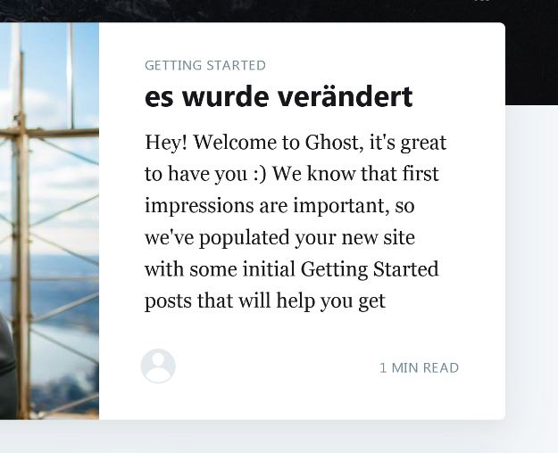

# LB3
***

blavla


## Inhaltsverzeichnis
***

- [Persönlicher Wissenstand](#Persönlicher-Wissenstand)
- [K3](#K3)
- [K4](#K4)
- [K5](#K5)
- [K6](#K6)
  

## Persönlicher Wissenstand
***
[^ **Nach oben**](#Inhaltsverzeichnis)

### Containerisierung/Docker
***

Docker kenne ich ein wenig von einem ÜK. Weiss aber nicht genau wie das funktioniert bzw. wie man es genau aufsetzt und braucht.

### Microservices
***

Microservices habe ich auch schon gehört, kann mir aber nicht genauers vorstellen was dies genau ist.


## K3
***
[^ **Nach oben**](#Inhaltsverzeichnis)

Zum Umsetzen von K3 habe ich mich für Ghost einschieden. Gost ist eine Open Source Blogging Plattform die auf Java Skript geschrieben ist.

Dazu habe ich lediglich ins Vagrantfile (Link) die 2 Startbefehle reingeschrieben das es bei aufstarten alles automatisch startet.

Nachher habe ich noch ein eingenes Volumes für den Contaier errichtet:    
```
VOLUME /var/lib/docker/volumes

 docker run -d -p 2368:2368  -v ~/data/gost:/var/lib/docker/volumes --name gost --rm gost
```

Zum das ganze zu Überprüfen ob es funktioniert bin ich auf die Webseite gegangen (localhost:2368).


Dort sieht man die Startseite, um diese zu verändern. Muss man auf localhost:8080 zugreiffen.
Dort habe ich den Titel vom ersten Blog verändert um zu schauen ob dies funktioniert.    





## K4
***
[^ **Nach oben**](#Inhaltsverzeichnis)

Um die Sicherheit von der VM und den Containers zu garantieren habe ich folgende Massnahmen getroffen:    

Ein Container erstellt der eine Benachrichtigung ausgibt wenn es Fehler gibt oder ein Docker zu viele Ressourcen braucht.    
Wenn ein Container veraucht soll dieser Automatisch wieder neu starten.     
Die Benutzer/Uster haben nur die nötigsten Rechte.   
Die Container laufen nicht alls root.    
Die Container die erfahrungsgemäss wenig CPU Leistung brauchen, gibt man weniger CPU zur Verfügung.

## K5
***
[^ **Nach oben**](#Inhaltsverzeichnis)

### Vergleich Vorwissen - Wissenszuwachs
***

#### Containerisierung/Docker

Ich konnte mich sehr intensiv mit dem Thema auseinander setzten. Ich verstehe jetzt auch genauer was gemeint ist das dies die Zukunft sein werden wird. Es macht das genze viel einfacherer.

#### Microservices

Der Wissenszuwachs war bei mir jetzt in diesem Thema nicht sehr gross. Da es mich aber intressiert werde ich mich in Zukunft genauer damit beschäftigen.

## K6
***
[^ **Nach oben**](#Inhaltsverzeichnis)

